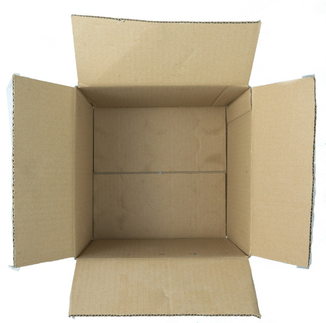

# Project Title




One Paragraph of project description goes here

### Install

What things you need to install the software and how to install them

```
Give examples
```

### Configuration Options

A step by step series of examples that tell you how to get a development env running

## Built With

* [React]() - The web framework used
* [ParcelJS](https://parceljs.org/) - ParcelJS zero configuration web application bundler
* [ESLint](https://eslint.org/) - linting for code quality
* [Prettier](https://prettier.io/) - code formatter for consistent code output
* [HUsky](https://github.com/typicode/husky#readme) - prevent bad git commit, git push and more
* [SASS](https://sass-lang.com/) - ready for SASS/SCSS stle sheets with minification and sourcemaps (or any other style system)

## Contributing

Please read [CONTRIBUTING.md](./CONTRIBUTING.md) for details about  the process for submitting pull requests to us.

## Versioning

We use [SemVer](http://semver.org/) for versioning. For the versions available, see the [tags on this repository](https://github.com/your/project/tags).

## Authors

* **Chuck Smith** -  [Eclectic Coding](https://github.com/eclectic-coding)

See also the list of [contributors](https://github.com/eclectic-coding/this-repo/contributors) who participated in this project.

## License

This project is licensed under the MIT License - see the [LICENSE](LICENSE) file for details

## Acknowledgments

* Your name could be here

